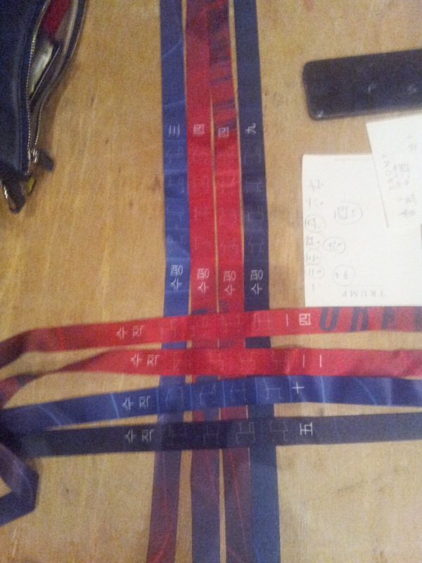
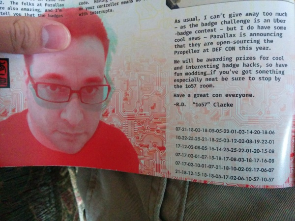
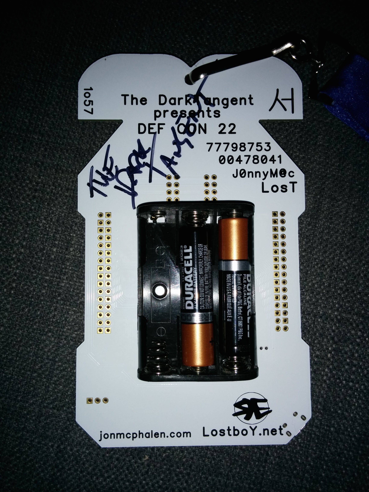
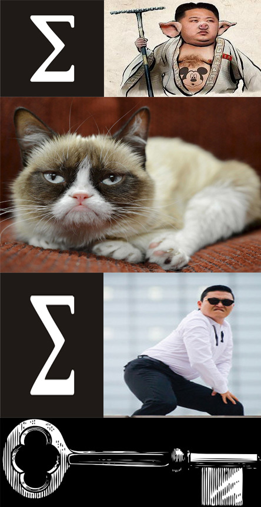

Last week I was lucky enough to attend DEF CON for the first time and it did not disappoint. I've been out of commission for a few days with the con plague, but I'm feeling well enough now to try some blogging.

This isn't the first write up to appear for the badge challenge. There's the [winning team's write up](http://elegin.com/dc22/), and runner up [team potatoe sec's](http://potatohatsecurity.tumblr.com/post/94565729529/defcon-22-badge-challenge-walkthrough) write up.

Why am I writing another one? Mostly it's because I wanted to make sure I really understood the challenge and it's solution. Additionally, I've noticed that the other two are either missing steps, or contain mistakes.

Let's start with some background (you can skip this if you know about the badge challenge). DEFCON is a hacker conference, and hackers love puzzles. As a result, for the past 5 years (I think) [1o57](https://twitter.com/1o57) has created a series of mind bending puzzles centered around the badges that DEFCON attendees get. It's designed to be solved in 3 days and force people to interact and talk since there are multiple different types of badges.

My interest in the badge challenge first got piqued when I read through a DC21 walkthrough by [last year's winning team](http://elegin.com/dc21/). I didn't have a team or the willingness to miss all the other things going at DEFCON, so most of this walk through is based off of the two guides I mentioned above and a taxi ride with a member of the runner up team on the way to the airport, and the fine folks who hung around room 1057.

So, what follows is as legible and clear a walkthrough as I can manage. Please leave comments if you spot any mistakes, or feel I've explained something using an identity like 2+2=5.

If you want to follow along at home, you can download [this archive](https://dl.dropboxusercontent.com/u/9393938/dc22-badge.zip) which contains as much of the badge challenge materials as I could manage to gather together. I'm still missing good photos of the front and back of all the badges, so if you have a one, please send it my way.

Final note: unless otherwise noted, all materials that follow (include the text) is released under a [creative commons attribution license](https://creativecommons.org/licenses/by/4.0/)

# Lanyards

(source: me)

This is the lanyard. There are 3 important parts to it.

First, there's the Chinese numbers on the left, which you can read with this handy chart:

    一      1
    二      2
    三      3
    四      4
    五      5
    六      6
    七      7
    八      8
    九      9
    十      10

Then, here are the weird symbols in the middle. Those are 4 digit numbers written using the Cistercian cipher from [The Ciphers of the Monks](https://en.wikipedia.org/wiki/The_Ciphers_of_the_Monks). You can decode them with:

(source: [The Ciphers of the Monks](http://www.davidaking.org/Ciphers.htm))

The last part is a Korean word, saying either vertical or horizontal

수직 (sujig): vertical

수평 (supyeong): horizontal

Big thanks to 1o57, who showed up at one point with a full set of EIGHT lanyards, pictured below

(source: me)

It was pretty tough trying to gather all of them. Initially, the total number of lanyards was unclear.

We had a hell of a time trying to gather all of the lanyards before 1o57, since we assumed the numerals were unique and didn't look for the other 4 and we thought there might be a lanyard with a Chinese 1 or 3. Also, we thought there might even be 9 lanyards, since there were 3 "suits" in the DEFCON iconography: (the happy skull and cross-bones, the rotary dial and the floppy disk).

Anyway, how do you decode these?? It turns out the Cistercian numbers are all in the range of upper case decimal ASCII, but without an ordering it's gibberish.

First, you have to divide the lanyards into vertical and horizontal.

At one point LoST mentioned that he really loved weaving potholders as a kid, so clearly the lanyards need to be woven together in some fashion.

Next, it turns out that all of the lanyards are less than 15, so they can be written in binary using only 4 bits.

Horizontal

     3 | 0 0 1 1
     4 | 0 1 0 0
     4 | 0 1 0 0
     9 | 1 0 0 1

Vertical

     5 10 11 14
     ---------------
     1  0  1  0
     0  1  1  0
     1  0  0  1
     0  1  1  1

Finally, you might also have noticed that two of the lanyards start with the encoded version for 1057.

Now, you can combine all of this information to form the solution.

The Chinese numbers can be arranged in such a way that it forms a grid of all 1s, indicating which square on which lanyard should be read to form the final message.

The ordering starts with 11 on top of the 4 lanyard with 1057 on it.

From there, there is always only one lanyard that can be placed such that the grid of all 1s is formed.

Here's the final weave:

(source: me)

Reading off the numbers and converting to ASCII you get:

     1057DONTMISSTHEPOINTINCURIOUSCODES

or

     1057 DONT MISS THE POINT IN CURIOUS CODES

There are 2 things you need to solve this puzzle:

1. 1o57 told us to take this literally. EXTREMELY LITERALLY
1. There are a whole bunch of new TLDs that got released recently...

The solution is curious.codes, which leads to the following url:

[http://curious.codes/](http://curious.codes/)

Which contains this link:

[Did you get Nuke Nuke Mickey Lover yet?](http://curious.codes/NukeNukeMickeyLover)

Running file on it reveals that it's a rar archive.

When you try to open it, you are asked for a password.

## Program Code

(source: me)

In the DEFCON program under the section by 1o57, there's a series of numbers transcribed below:

    07-21-18-03-18-05-05-22-01-03-14-20-18-06
    10-22-25-25-21-18-25-03-12-02-08-19-22-01
    17-12-02-08-05-16-14-25-25-22-01-20-15-08
    07-17-02-01-07-15-18-17-08-03-18-17-16-08
    07-17-02-10-01-07-21-18-10-02-02-17-06-07
    21-18-12-15-18-18-05-17-02-06-10-57-10-57

Notice that all of the numbers are less than 26 (with the exception of 1o57's signature at the end), so it's time to convert these numbers to letters (1 -> a, 2 -> b, etc...), which results in:

     gurcreevacntrfjvyyuryclbhsvaqlbhepnyyvatohgqbagorqhcrqphgqbjagurjbbqfgurlorreqbfj

The thing I learned doing the challenges: Always try [rot13](http://web.forret.com/tools/rot13.asp).

     THEPERRINPAGESWILLHELPYOUFINDYOURCALLINGBUTDONTBEDUPEDCUTDOWNTHEWOODSTHEYBEERDOS

or

the perrin pages will help you find your calling but dont be duped cut down the woods they be erdos

Above some of page numbers in the program, there are numbers written. Here is the whole set:

number: 32 35 31 41 53 45 41 43 52 45 45 4D 41 54 45 21 21
page:    2  3  5  7 10 12 16 17 22 29 33 34 36 39 46 51 56

A bit of googling reveals a few things. There are  [Perrin Numbers](https://en.wikipedia.org/wiki/Perrin_number), which is a sequence defined by a recursive relation. The first few I grabbed from [The Online Encyclopedia of Integer Sequences](https://oeis.org/A001608) (yes there is apparently such a thing)

     3, 0, 2, 3, 2, 5, 5, 7, 10, 12, 17, 22, 29, 39, 51, 68

There are also things called [Erdos-Woods numbers](https://en.wikipedia.org/wiki/Erd%C5%91s%E2%80%93Woods_number). Again from [OEIS A059756](https://oeis.org/A059756):

     16, 22, 34, 36, 46, 56

Let's start by reducing the numbers to just Perrin numbers

    number: 32 35 31 41 53 45 43 52 45 54 45 21
    page:    2  3  5  7 10 12 17 22 29 39 46 51

Next, let's 'cut down the woods' by removing the Erdos Woods Numbers that aren't also Perrin numbers ('don't be duped'). NOTE: This bit seems to have been missed by a the 2 other write-ups

     16, 34, 36, 46, 56

.

    number: 32 35 31 41 53 45 43 52 45 54 21
    page:    2  3  5  7 10 12 17 22 29 39 51

How do we decode 32 35 31 41 53 45 43 52 45 54 21? Well we saw earlier that one of the superscripts was 4D, so let's go with [ASCII Hex](http://www.asciitohex.com/)

     251ASECRET!

Hey, that's a phone number (the hint being calling)

251-273-2738

If you call it, it will ring and ring and eventually you'll get a recording of a piano, which you can listen to below:

[piano.wav](https://dl.dropboxusercontent.com/u/9393938/Piano.wav)

Transcribing the notes we get:

    DGGBGBGGDGBDGDGBDDDBDGEGDGDGDBDDDBGDGBDDGEDGGDGBGDDDDBDDDDDBGGGGGBDDGGGEDGGDGBGGGBGDBGDGBGDBDGBDDGBGGGGBGDBGE

Hrmmm, not many Bs or Es... Let's try removing those to see what it looks like

    DGG G GGDG DGDG DDD DG GDGDGD DDD GDG DDG DGGDG GDDDD DDDDD GGGGG DDGGG DGGDG GGG GD GDG GD DG DDG GGGG GD G

Since there's only 2 letters it's either binary or morse code. Let's see what it looks like if the Ds are dashes and Gs are dots

    -.. . ..-. -.-. --- -. .-.-.- --- .-. --. -..-. .---- ----- ..... --... -..-. ... .- .-. .- -. --. .... .- .

(source [wikipedia](https://upload.wikimedia.org/wikipedia/commons/thumb/b/b5/International_Morse_Code.svg))

Putting that string into a [morse code translator](http://morsecode.scphillips.com/jtranslator.html)

We get:

     DEFCON.ORG/1057/SARANGHAE

SarangHae is Korean for I love you, so fixing the capitlization we get

https://www.defcon.org/1057/SarangHae/

Which reads:

    Who we gave free love to

    at

    1o57

    Are you being served?

Alright, we have to pause on this track for now since we don't know "Who we gave free love to" (googling reveals nothing), although [Are you being served](https://en.wikipedia.org/wiki/Are_You_Being_Served%3F) is apparently a british TV Show.

This looks like it might be an email address though: SOMETHINGGOESHERE@1o57.uk

# Badges

There are quite a few cool things about the badge. It's a fully programmable propeller including an astounding array of through holes for attaching your own electronics to. It also has a microusb port so it's pretty easy to program from any computer.

According to the [parallax forums](http://forums.parallax.com/showthread.php/156782-DEFCON-22-Badge-Code-Schematics-and-Information-Here!) there are 15 types of badges: 1 uber, 1 press, 1 speaker, 1 vendor, 1 goon, 1 contest, 1 artist and 8 human badges.

The differences between the human badges seem to be the following:

 1. Different styles of writing Human across the bottom
 2. The pattern of pads just above the 8 LEDs
 3. The symbol and numbers on the back

## Badge Pads

One of the other weird features of the badges is that there are 2 different types of pads: circular and square. These are a binary encoding, where the circular pads are zeros and the square pads are ones. Writing this out from top to bottom and left to right gives us the following:

    0110
    0101
    0111
    0110
    0110
    0110
    0110
    0101
    0111
    0111
    0100
    0110
    1000
    0101
    1000
    0011

Which we can turn into the following numbers

    6
    5
    7
    6
    6
    6
    6
    5
    7
    7
    4
    6
    8
    5
    8
    3

Grouped in twos

     65 76 66 65 77 46 85 83

and converted into ASCII (base 10) gives us:

     ALBAM.US

http://albam.us/

Which contains a bunch of weird looking text

     Bsz zfw vbffn up cbei dt la xvf op wtpskcuujjo? Rdjuk cybet uf
     evlc dbfovozivnj?

     T'fm mzu pqp ie zh b mduknz svnlfu...rivp D'm wpymjih ugalreye J
     npdgoidpm uidob qa flyhz mduknz wfcxt, mdlv uzxktff (svxi-tvr!) ryx tvyevpgy Z'x
     vbdf gvggier fjlz J tci dzlf ju do rivie. Yix xcbk yvs ksuu poivt aueys xpme? Zv
     MERWFZ ive da iudmys...J ptlcglp suwf op kjdnb zz ju zjxjo tzxyt ji b iqr bvqisf D gvgg
     lzvy nznfch vgrth...

This looks pretty garbled and it's not a simple rot13 either. We will come back to this later once we have the key

## Badge Output

You can plug the DEFCON 22 badges into a computer and connect to it as a serial terminal. An easy way to do this is to install the [PropellerIDE](http://forums.parallax.com/showthread.php/153921-Open-Propeller-Project-3-Propeller-IDE-V0.1-Package-Available?p=1283880&viewfull=1#post1283880). You can also connect to it using screen (or with busybox microcom I think). The baud rate for the connection is 57600

When you first connect the badge spits out a lot of nonsense like this:

                    MARRY AND REPRODUCE
                      NO IMAGINATION
          MARRY AND REPRODUCE
                    NO IMAGINATION
                    WATCH TV
                        NO INDEPENDENT THOUGHT
                      MARRY AND REPRODUCE
                  WORK EIGHT HOURS
                    EAT
                    NO INDEPENDENT THOUGHT
        NO INDEPENDENT THOUGHT
          EAT
                  BUY
                WORK EIGHT HOURS
                MARRY AND REPRODUCE
                BUY
                  OBEY
                CONFORM
                    WATCH TV
        CONSUME
                          DO NOT QUESTION AUTHORITY
    MARRY AND REPRODUCE
                  MARRY AND REPRODUCE
                  BUY
      CONSUME
                            NO INDEPENDENT THOUGHT
      STAY ASLEEP
        OBEY
                          CONFORM
      WATCH TV
        EAT
                  NO INDEPENDENT THOUGHT
    WATCH TV
                    NO IMAGINATION
                            CONSUME
                      CONSUME
    CONSUME
                            EAT
                            BUY
    CONSUME
                        BUY
                        NO IMAGINATION
                    DO NOT QUESTION AUTHORITY
                      DO NOT QUESTION AUTHORITY
                    EAT
      NO INDEPENDENT THOUGHT
                      WORK EIGHT HOURS
              NO IMAGINATION
    WORK EIGHT HOURS
                          CONFORM
          SUBMIT
          DO NOT QUESTION AUTHORITY
                        BUY
      SUBMIT
                          OBEY
                            DO NOT QUESTION AUTHORITY
          STAY ASLEEP
                          CONFORM
                        NO INDEPENDENT THOUGHT
    SUBMIT
            WATCH TV
              MARRY AND REPRODUCE
            CONSUME
                EAT
          MARRY AND REPRODUCE
      MARRY AND REPRODUCE
                      CONSUME
        STAY ASLEEP
        CONSUME
              STAY ASLEEP
                  BUY
          NO IMAGINATION
    EAT
                            SUBMIT
                    MARRY AND REPRODUCE
                        SUBMIT

All of these are references to a movie called [They Live](http://www.imdb.com/title/tt0096256/) but there's nothing particularly interesting in this output. The REALLY interesting stuff happens when you push the buttons on the badge.

What buttons you ask? Well the E F C O in DEFCON along the bottom of the badge are capacitive buttons! Here's the output for various combinations of button pushes

Pushing the C (0010)

    WELCOME TO DEFCON TWENTY TWO

    COME AND PLAY A GAME WITH ME

Pushing the O (0001)

    WHERE TO BEGIN I KNOW FIND HAROLD

Pushing the F and O (0101)

    DEFCON DOT ORG SLASH ONE ZERO FIVE SEVEN SLASH I WONDER WHAT GOES HERE

Pushing the F C and O (0111)

    TRY THE FIRST HALF OF HIS PHONE NUMBER FOLLOWED BY HIS LAST NAME THEN THE SECOND HALF OF HIS NUMBER

Pushing the E (1000)

    ALBERT MIGHT BE ON THE PHONE WITH HAROLD SO IF ITS BUSY TRY BACK

Pushing the E and O (1001)

    WHITE LINES IN THE MIDDLE OF THE ROAD THATS THE WORST PLACE TO DRIVE

We need to find a Harold so we can use his phone number to build a url. [1o57 tweeted](https://twitter.com/1o57/status/497892280838025216) a pretty huge hint about this part of the challenge:

[twitter url="https://twitter.com/1o57/status/497892280838025216"]

    Major hint- this is Defcon 22- 22 is a Smith number.

Some googling reveals that a [Smith Number](https://en.wikipedia.org/wiki/Smith_number) is a number where the sum of the digits are the equal to the sum of the digits of it's prime factors. They were discovered by Albert Wilansky who noticed that his brother in law Harold Smith had a phone number with this property. Sounds promising!

His phone number from Wikipedia is 493-7775. Since there are a few possible ways to assemble this, you have to try a few URLs before you succeed with 493SMITH7773 resulting in:

https://www.defcon.org/1057/493SMITH7775/

There's a few import things about this page. First the poem:

     Why be
     ye searchin' answers here?
     Oh are
     ye 1o57? The question
     queue be
     long...be ye not in despair,
     em for
     keepin' ye from spinnin' yer wheels they be.

Every second line can be written as letters

     YB
     OR
     QB
     M4

The second thing we have from this page is found in the source code as a comment

     YQESMJDOJOTM

This is a dead end for now, but don't worry we will come back to it.

## Badge Serial Numbers

Sadly, I don't have pictures of the back of all of the badges, but here is mine:

(source: me)

As you can see in the top right corner there's a symbol. It's either a Chinese or a Korean cardinal symbol. Here's a table from [Team PotatoSec](http://potatohatsecurity.tumblr.com/post/94565729529/defcon-22-badge-challenge-walkthrough)

    Badge          Serial_1     Serial_2     Direction    Language
    Human          55586753     01458934     West         Chinese
    Human          25348567     02933985     East         Chinese
    Human          30303031     38563748     South        Chinese
    Human          56456387     01924834     North        Chinese
    Human          32439751     50932487     North        Korean
    Human          77798753     00478041     West         Korean
    Human          81303557     85345360     South        Korean
    Human          05978344     85758673     East         Korean
    Artist         94841634     88172253     South        Chinese
    Contest        09856563     23454311     East         Chinese
    Vendor         05729856     57380999     North        Korean
    Speaker        31337017     34029545     South        Chinese
    Goon           94841634     88172253     South        Chinese
    Press          06060606     00000000     South        Korean
    Uber           37584205     23785634     North/South  Korean

We have to stop here again, because we don't yet know what to do with these.

# X.XX Codes

At the conference, there were 2 large standing maps containing a series of numbers, and one large floor sticker also containing similar looking numbers. They were all in red, had a single Korean character above them and mostly followed the format of XX.XX

(source: me)

    전
    1.23
    2.23
    3.23
    3.13
    3.22
    2.22
    0.00
    6.22
    3.01
    1.02
    0.20
    0.03
    0.10

(source: me)

    화
    0.12
    0.01
    0.20
    6.23
    3.02
    4.01
    8.01
    6.02
    3.12
    9.02
    5.22
    4.02
    2.11

(source: me)

    기
    1.13
    6.12
    5.23
    9.12
    5.11
    6.13
    12.02
    4.23
    4.13
    1.11
    15.02
    9.22
    8.22

It turns out that the letters above spell telephone in Korean

Telephone: 전화기 (jeonhwa)

Now, in order to decode this mess, we first have to consider a phone keypad.

(source [wikipedia](https://upload.wikimedia.org/wikipedia/commons/thumb/7/73/Telephone-keypad2.svg))

Now, all the numbers directly to the right are between 0 and 2, and all of the final digits are between 0 and 3. And we have a 3 by 4 grid... It's a coordinate system for sure. Now the logical numbering would be from top to bottom and left to right... but that's wrong. Here's the numbered grid

(source: me and wikipedia)

The numbers to the left of the dot indicate how many times you should "press" the number, just like texting on a dumbphone.

Now the numbers decode to the following:

     전 = DEFCON*ORG#10
     화 = 57#FISSILINGU
     기 = ALELUCIDATION

giving us DEFCON*ORG#1057#FISSILINGUALELUCIDATION

cleaned up and capitalized properly

https://www.defcon.org/1057/FissilingualElucidation/

Which contains

    Here, I wrote you a poem:
    lorem ip
    Lorem ipsum dolor si
    Lorem ipsum do
    Lorem ipsum dolor s
    lorem ipsum ama
    Lorem ipsum dolor sit amet
    Lorem ipsum dolor sit ame

    Lorem ipsum dolor sit
    lorem ipsum ips
    lorem ipsum lor
    lorem ipsum lo
    lorem ipsum lorem
    lorem ipsum amat
    Lorem Ipsum

So the key for this **was** to run the poem through google translate, which through some fluke or possibly easter egg would translate to this:

    Let's see if
    We give
    Pussycat Dolls
    The Free Love
    It can be used
    Our goal is to ame

    Our goal is to
    vehicle dimensions
    Free of pain
    China, elsewhere
    Free Internet
    China loves
    NATO

Sadly, this no longer works for me ([and others it seems](http://krebsonsecurity.com/2014/08/lorem-ipsum-of-good-evil-google-china/), so big thanks once again to [Team PotatoSec for their write up](http://potatohatsecurity.tumblr.com/post/94565729529/defcon-22-badge-challenge-walkthrough)

Anyway, with this information we can now complete the email address from earlier! Free love is is given to Pussycat Dolls

# Email to pussycatdolls@1o57.uk

     To: Manfred Manx <f.alt.alt@gmail.com>
     From: "1o57" <pussycatdolls@1o57.uk>
     Subject: Can you feel the love tonight?
     DEFCON.ORG/1057/ WHO DOES CHINA LOVE + Mickey's Key

Ok, well we don't have Mickey's Key yet, but the poem tells us that China loves NATO. Let's continue on until we find Mickey's key.

# CD

On the CD there's a picture of a [Cryptex](https://en.wikipedia.org/wiki/Cryptex) which contains an awful lot of letters and numbers... Perfect for use as key material! Here's a picture

(source: [1o57](https://twitter.com/1o57/) I think)

And here's the whole thing transcribed

    CIZDRURREGUI
    DVTQIMUFNXNV
    QOHULDILKCFO
    PG2LTGEWPZRH
    KNRIGZWIOTIK
    BBVB4RCVARLU
    YQESMJDOJOTM

HEY! That's last line is the same as the one from 493SMITH7775 page!

It turns out that BBVB4RCVARLU is the passphrase for the block of text we saw earlier

    Bsz zfw vbffn up cbei dt la xvf op wtpskcuujjo? Rdjuk cybet uf
    evlc dbfovozivnj?

    T'fm mzu pqp ie zh b mduknz svnlfu...rivp D'm wpymjih ugalreye J
    npdgoidpm uidob qa flyhz mduknz wfcxt, mdlv uzxktff (svxi-tvr!) ryx tvyevpgy Z'x
    vbdf gvggier fjlz J tci dzlf ju do rivie. Yix xcbk yvs ksuu poivt aueys xpme? Zv
    MERWFZ ive da iudmys...J ptlcglp suwf op kjdnb zz ju zjxjo tzxyt ji b iqr bvqisf D gvgg
    lzvy nznfch vgrth...

One of the other teams thought this was an OTP, but in fact it's just a straight up [Vigenere Cipher](https://en.wikipedia.org/wiki/Vigen%C3%A8re_cipher) which we can decode with [this handy tool](http://rumkin.com/tools/cipher/vigenere.php)

The decrypted text using a key of BBVB4RCVARLU results in

    Are you about to hang it up due to frustration? About ready to
    call shenanigans?

    I'll let you in on a little secret...when I'm feeling deflated I
    sometimes think of funny little words, like sextile (rawr-rar!) and suddenly I'm
    back feeling like I can dial it in again. Now what was that other funny word? It
    REALLY had my number...I usually have to think of it eight times in a row before I feel
    like myself again...

So, some googling leads us to discover that a [Sextile](https://en.wikipedia.org/wiki/Sextile) looks a lot like an asterix! And there's a reference to the word dial, so we're looking for a funny word relating to telephones and dialpads or something.

That word is [Octothorp](https://en.wiktionary.org/wiki/octothorpe), but what to do with it? Well the poem does mention rar, so it's got to be the password to the rar file from earlier. There's also a reference to the number 8, which leads us to a password of

    OCTOTHORPOCTOTHORPOCTOTHORPOCTOTHORPOCTOTHORPOCTOTHORPOCTOTHORPOCTOTHORP

Time to decrypt that RAR! This gives us a folder containing 2 files. A copy of a song called [The Box by Ostritch](https://en.wikipedia.org/wiki/Ostrich_%28Crack_the_Sky_album%29) and this image

(source [1o57](https://twitter.com/1o57/))

Well, that's a pretty funny picture of [Kim Jong-un](https://en.wikipedia.org/wiki/Kim_Jong-un) but notice that he has Mickey on his belly. Somehow this image will help us create Mickey's key.

From earlier, we have a bunch of badges with North written in Korean and South written in Korean, which is probably why there's a picture of the leader of North Korea and [Psy](https://www.youtube.com/watch?v=9bZkp7q19f0) who's from South Korea.

The epsilon symbol indicates that the serial numbers should be summed and the grumpy cat indicates we should concatenate those two in order to get the key. (Completely obvious I know)

The sum of the North Korean serials is:

32439751 + 50932487 + 05729856 + 57380999 = 146483093

The sum of the South Korean serials is:

81303557 + 85345360 + 06060606 + 00000000 = 172709523

To create Mickey's key: 146483093172709523

# Final Puzzle

With the Mickey's key (146483093172709523) and the answer to who China love's (NATO) we can now finish the URL from earlier

DEFCON.ORG/1057/ WHO DOES CHINA LOVE + Mickey's Key

 = DEFCON.ORG/1057/NATO146483093172709523

https://www.defcon.org/1057/NATO146483093172709523

Well the page is called Almost There!, so we must be close! On that page there's a silly moon gif and this:

(source [1o57](https://twitter.com/1o57/))

Now this turns out to be written in a language called [Ogham](https://en.wikipedia.org/wiki/Ogham)

(source: (source [wikipedia](https://en.wikipedia.org/wiki/Ogham))

Which gives us the following translation:

    I OFT CORRECT NGOUR GRAMMER
    OR TELL NGOU TO NEE A NGSNGCHIATRIST
    BUT THE FILEN ASSIFTNG TO NGIERCE
    THE LAFD THAT CRAFEN FEST UNGOF
    MIGHT LEAD NGOU TO DINCOER
    FAME OS THE MOOF AT CODES THAT ARE CURIOUS

Alright, time to clean that up. There are a few substitutions we need to make

NG -> Y

N  -> S

S  -> F

F  -> N

Y  -> P

But only sometimes, and sometimes more than once. For example I had to replace the 3 S's in ASSISTNG, and then replace the 3rd F with an N. EDIT: turns out I transcribed the ogham wrong. Thanks Chris in the comments.

Also, Ogham doesn’t contain a letter for W, so we have to add it where it’s missing.

Here's there cleaned up version:

    I WONT CORRECT YOUR GRAMMER
    OR TELL YOU TO SEE A PSYCHIATRIST
    BUT THE NILES AFFINTY TO PIERCE
    THE LAND THAT CRANES NEST UPON
    MIGHT LEAD YOU TO DISCOVER THE
    NAME OF THE MOON AT CODES THAT ARE CURIOUS

There are a few references here that need to be gathered together to make sense. If you google niles pierce and crane, you get to a page about [David Hyge Pierce](https://en.wikipedia.org/wiki/David_Hyde_Pierce) who played a psychiatrist on [Frasier](https://en.wikipedia.org/wiki/Frasier), so clearly we're on the right track. A search for moon on that wikipedia page reveals that Niles' wife in the show is [Daphne Moon](https://en.wikipedia.org/wiki/Daphne_Moon).

The line about "name of the moon at codes that are curious" seems to indicate an email address for the curious.codes domain.

"Name of the moon" hints that we want the actress that plays Moon who is [Jane Leeves](https://en.wikipedia.org/wiki/Jane_Leeves)

Now to send an email to:

janeleeves@curious.codes

# THE END?

You will get a reply

    To: Manfred Manx <f.alt.alt@gmail.com>
    From: "1o57" <janeleeves@curious.codes>
    Subject: The end of the journey

    +++
    Well done!

    Find 1o57, and hand him a note- written on blue paper....

    On the note must be your name(s)  / team name - and this phrase:

    perfer et obdura; dolor hic tibi proderit olim

    Congratulations, you have earned a spot ... but I've said too much...

    Include an email :)

    ----

Wooo! That's the end! I hope you enjoyed the ride. If you're the curious type (which I have no doubt is the case if you've made it this far), the latin translates to "Be patient and tough; someday this pain will be useful to you"

I've got to thank 1o57 for putting together this puzzle, [Elegin](http://elegin.com/dc22/) and [Team PotatoSec](http://potatohatsecurity.tumblr.com/post/94565729529/defcon-22-badge-challenge-walkthrough) without their guides I wouldn't have been able to put this guide together.

# Appendix

## Dead ends

So there are a lot of dead ends in this quest. There were quite a few references to [The Last Dragon](https://en.wikipedia.org/wiki/The_Last_Dragon) which didn't lead anywhere.

There were lots of images included all over the place that didn't lead anywhere (the mighty boosh moon, the popcorn gif, the lost boys movie poster)

There's the song file that was included in the RAR archive.

If you go to https://www.defcon.org/1057/ directly, you'll notice at the bottom that there's some hidden text that reads " Did you try 1057 yet?"

https://www.defcon.org/1057/1057/ seems to just be taunting you.

There also seems to be some variations in the style of pads on the front of the badges.

The badges include an IR transmitter and receiver, and goon badges can control the human badges. Likewise, the uber badge can [control all the other badges](https://www.youtube.com/watch?v=63K2S_hhFxk). Some folks on reddit [decoded the meaning of the flashing](http://www.reddit.com/r/Defcon/comments/2cwgnr/badge_hacking/cjke1eb)

The floor decal includes some bumps and such, but I don't think it will decode to anything.

What's the reference to "WHITE LINES IN THE MIDDLE OF THE ROAD THATS THE WORST PLACE TO DRIVE" in the badge?

There's references to a bunch of different names and types in the badge firmware code:

    RayNelson
    Test4
    Greets
    Detective
    Scientist
    Diver
    Driver
    Politician
    Test3
    Football
    Mystery

These are just some of the dead ends I saw while putting this together.

## LINKS

- http://elegin.com/dc22/
- http://potatohatsecurity.tumblr.com/post/94565729529/defcon-22-badge-challenge-walkthrough
- http://www.reddit.com/r/Defcon/comments/2cwgnr/badge_hacking/

- http://albam.us/
- https://www.defcon.org/1057/FissilingualElucidation/
- https://www.defcon.org/1057/SarangHae/
- https://www.defcon.org/1057/493SMITH7775/
- https://www.defcon.org/1057/NATO146483093172709523
- http://curious.codes/

This work is licensed under a [Creative Commons Attribution 4.0 International License](http://creativecommons.org/licenses/by/4.0/)
