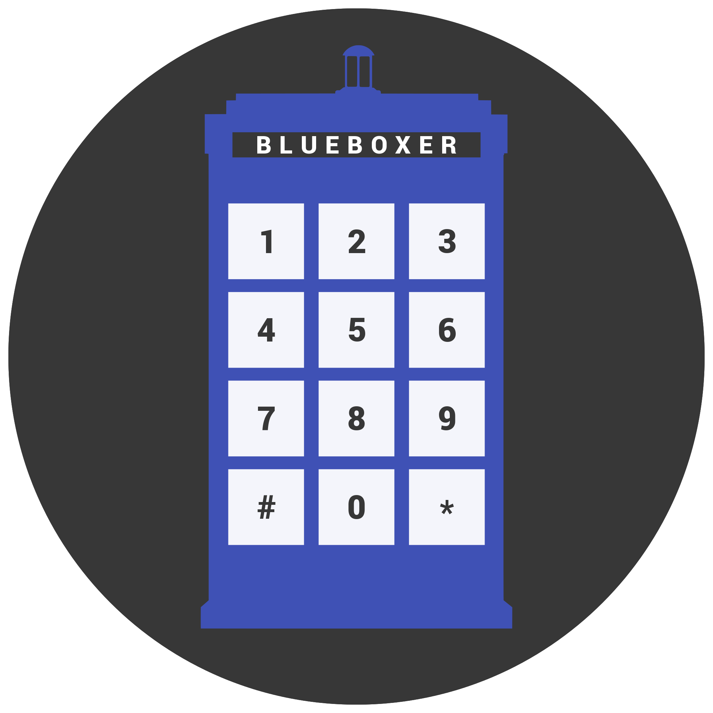

I've recently becoming super interested in [Blue boxes](https://en.wikipedia.org/wiki/Blue_box). No, I don't mean Tardises (Tardii? Tardeese?) I mean one of the primary tools of Phone Phreaks during the 70s, 80s and early 90s. Apparently they became quiet popular after an [article in Esquire](http://www.lospadres.info/thorg/lbb.html) in 1971.

Blue boxes worked because the telephone companies made a huge mistake and used in-band control signals. That is to say, all the messages that accounting or routing offices used to talk to one and other were transmitted in the same band (and in the same way) as people's voices. This meant that people could trick telephone equipment by pretending to be other phone equipment. Most famously, you could play a tone at 2600Hz and trick the receiving end of a phone call into thinking you had hung up without actually hanging up. This left the caller able to make new calls, while the billing system thought the original call was still going on. If you called a 1-800 (or some other toll free number) that meant you could talk for free!

These days signaling of this sort happens out of band, so the study and use of blue boxes these days is mostly academic / nostalgic. Although, I did recently find [Project MF](http://www.projectmf.org/) which is a VOIP recreation of the old phone networks. If only I had a blue box...

Which brings me to the main point of this blog post. I've started [building a software blue box for android](https://github.com/tahnok/Blueboxer). I think it might be broken right no, but it's been an interesting excuse to learn RxJava and to have an excuse to learn exactly how blueboxes worked.

It turns out that the tones you need to mess with the system are called **Operator Dialed Multi Frequency (MF) Tones**, or just MF tones. As you might guess, they are made up of multiple frequencies, specificially 2 tones that are either 700Hz, 900Hz, 1100Hz, 1300Hz, 1500Hz or 1700Hz. Here's a table (from wikipedia that breaks down the combinations)

<table class="wikitable">
<tbody><tr>
<td colspan="7" align="center">Operator (blue box) dialed MF tones</td>
</tr>
<tr>
<th align="center">Code</th>
<th align="center">700&nbsp;Hz</th>
<th align="center">900&nbsp;Hz</th>
<th align="center">1100&nbsp;Hz</th>
<th align="center">1300&nbsp;Hz</th>
<th align="center">1500&nbsp;Hz</th>
<th align="center">1700&nbsp;Hz</th>
</tr>
<tr>
<td align="center"><b>1</b></td>
<td align="center">X</td>
<td align="center">X</td>
<td></td>
<td></td>
<td></td>
<td></td>
</tr>
<tr>
<td align="center"><b>2</b></td>
<td align="center">X</td>
<td></td>
<td align="center">X</td>
<td></td>
<td></td>
<td></td>
</tr>
<tr>
<td align="center"><b>3</b></td>
<td></td>
<td align="center">X</td>
<td align="center">X</td>
<td></td>
<td></td>
<td></td>
</tr>
<tr>
<td align="center"><b>4</b></td>
<td align="center">X</td>
<td></td>
<td></td>
<td align="center">X</td>
<td></td>
<td></td>
</tr>
<tr>
<td align="center"><b>5</b></td>
<td></td>
<td align="center">X</td>
<td></td>
<td align="center">X</td>
<td></td>
<td></td>
</tr>
<tr>
<td align="center"><b>6</b></td>
<td></td>
<td></td>
<td align="center">X</td>
<td align="center">X</td>
<td></td>
<td></td>
</tr>
<tr>
<td align="center"><b>7</b></td>
<td align="center">X</td>
<td></td>
<td></td>
<td></td>
<td align="center">X</td>
<td></td>
</tr>
<tr>
<td align="center"><b>8</b></td>
<td></td>
<td align="center">X</td>
<td></td>
<td></td>
<td align="center">X</td>
<td></td>
</tr>
<tr>
<td align="center"><b>9</b></td>
<td></td>
<td></td>
<td align="center">X</td>
<td></td>
<td align="center">X</td>
<td></td>
</tr>
<tr>
<td align="center"><b>0</b>/10</td>
<td></td>
<td></td>
<td></td>
<td align="center">X</td>
<td align="center">X</td>
<td></td>
</tr>
<tr>
<td align="center">11/ST3</td>
<td align="center">X</td>
<td></td>
<td></td>
<td></td>
<td></td>
<td align="center">X</td>
</tr>
<tr>
<td align="center">12/ST2</td>
<td></td>
<td align="center">X</td>
<td></td>
<td></td>
<td></td>
<td align="center">X</td>
</tr>
<tr>
<td align="center"><b>KP</b></td>
<td></td>
<td></td>
<td align="center">X</td>
<td></td>
<td></td>
<td align="center">X</td>
</tr>
<tr>
<td align="center">KP2</td>
<td></td>
<td></td>
<td></td>
<td align="center">X</td>
<td></td>
<td align="center">X</td>
</tr>
<tr>
<td align="center"><b>ST</b></td>
<td></td>
<td></td>
<td></td>
<td></td>
<td align="center">X</td>
<td align="center">X</td>
</tr>
</tbody></table>

I was unable to find a set of tones for this anywhere on the web, so I whipped up my own using Audacity.
Here is a [set of 60ms long MF tones in ogg format](https://github.com/tahnok/Blueboxer/tree/master/app/src/main/res/raw), or [the raw audacity projects](https://github.com/tahnok/Blueboxer/tree/master/raw_tones)

Soon I will publish the app on the play store (and probably F-Droid as well), and I'll have to see if it works with Project MF

ps If you are looking for more retro fun times check out [Telehack](http://telehack.com/)
