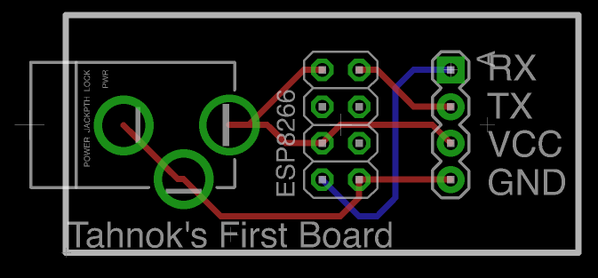

So I got something REALLY COOL this week in a purple envelope.
That's right I got 3 PCBs that I designed myself from Oshpark

Aww yiss!

Now of course, it's actually a really simple board that I could have done without, but the point was mostly to learn how to use Eagle,
and a PCB manufacturing service like [OSH park](https://oshpark.com/).

WTF is OSH park you ask?
It's a PCB manufacturing service that caters to small runs.
They get away with this by collecting submissions from lots of people and then putting all of them together on one big panel.
It's also pretty cheap, my boards only cost my 5$.
Also note the sweet purple colour (that's called the solder mask)

The software I chose to use was Eagle, which has a free to use (not a Free as in open source though) version available.
The pro version costs many dollars, and the free version has some limitations, but I haven't run into any of them.
I considered using the open source [Kicad](http://www.kicad-pcb.org/display/KICAD/KiCad+EDA+Software+Suite), but I found some better tutorials for Eagle (more on that later) and my local makerspace has quite a few advanced Eagle users.

I have to give most of the credit for my amazing board design to [Sparkfun](http://sparkfun.com/) because it was their tutorials which taught me everything I know (not that much tbh). They have a large number of random [tutorials with the eagle tag](https://learn.sparkfun.com/tutorials/tags/eagle), and I followed three in particular:

 1. [How to setup and install eagle](https://learn.sparkfun.com/tutorials/how-to-install-and-setup-eagle): more than just set up, it also does a good job giving an overview of some of the pieces of eagle
 2. [Using Eagle: Schematic](https://learn.sparkfun.com/tutorials/using-eagle-schematic): teaches you how to make a schematic
 3. [Using Eagle: Board Layout](https://learn.sparkfun.com/tutorials/using-eagle-board-layout): this one teaches you how to turn a schematic into a board layout

At the end of them, you'll have a very basic arduino board all laid out and (almost) ready to ship to OSH park.

The tl;dr of those tutorials is this: Eagle is designed around 2 "views" schematic and layout.
First you create a schematic which shows which parts your project uses and how they connect.
Next you create a layout where you must place all your components and wires on the actual pcb.

The final step is sending the board off to the "fab".
They seem to expect to receive everything as "gerber" files, which are basically instructions as to what should be done for each "layer" of the pcb.
The sparkfun tutorial I walked through covered this a bit, but when I went to upload to OSH park I was missing certain pieces.
Thankfully OSH park can handle a eagle layout files automatically.

My first board is called **ESPOWER** [eagle source files on github](https://github.com/tahnok/espower) and it's really really (really) simple.

It contains:

 - a barrel jack for power on the left
 - a 4x2 set of standard 0.100" headers (like those found on an arduino) to connect to an ESP8266
 - a 4x1 set of headers for connecting to the ESP8266 over serial

That's all.
My only goal is to be able to power an ESP8266 (this 3$ wifi enabled micro controlled) from a standard wallwart for a top secret project I am working on.
I don't actually know if I've succeeded in making a functioning board yet...
I am still waiting on the parts to populate the board to arrive, but I've certainly learned a bunch in the process.
