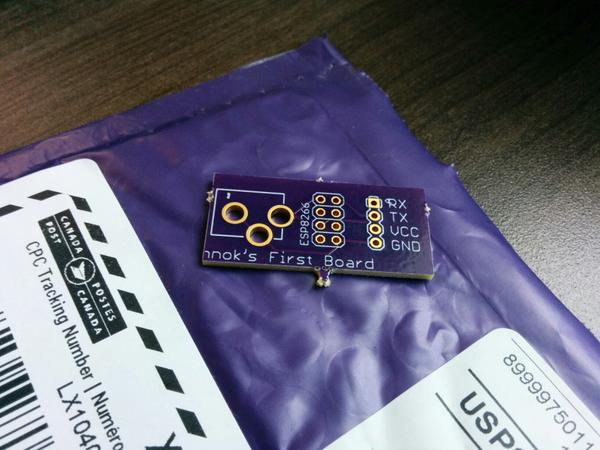

So I got something REALLY COOL this week in a purple envelope. That's right I got 3 PCBs that I designed myself from Oshpark

Aww yiss!

Now of course, it's actually a really simple board that I could have done without, but the point was mostly to learn how to use Eagle,
and a PCB manufacturing service like Oshpark.

Oshpark is pretty cool, my 3 little boards only cost 5$. Basically, they provide PCB manufacutring services for small runs of things.

The software I chose to use was Eagle, which has a free to use (not a Free as in open source though) version available that has some limitations, but I haven't run into any of them. I considered using the open source Kicad, but I found some better tutorials for Eagle (more on that later) and my local makerspace has quite a few advanced Eagle users.

PCB design software is one of those things that is very clearly designed for engineers, by engineers. The UI in Eagle is weird and complicated, but of course it has advanced scripting capabilities!

I wasn't sure where to start at first, but Sparkfun has a series of REALLY amazing tutorials where you walk through the process of making a really simple arduino board.
