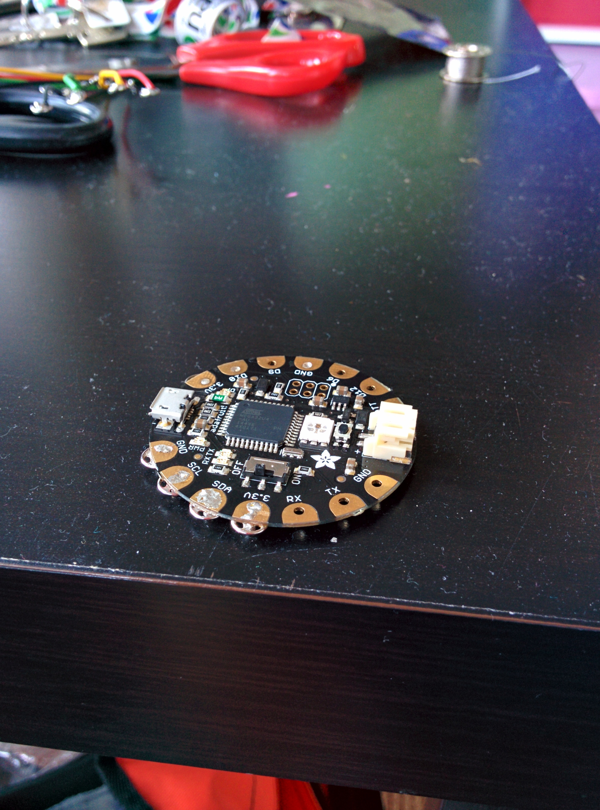
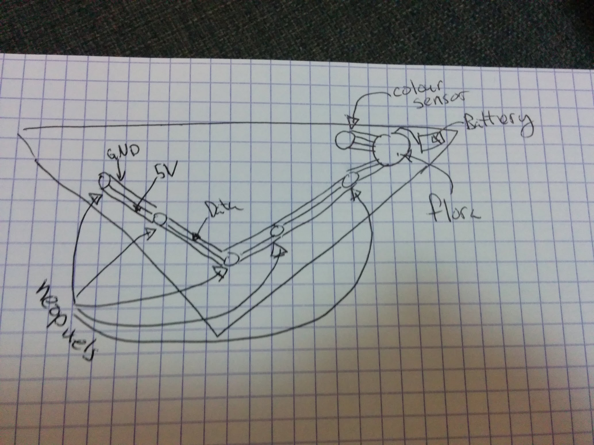
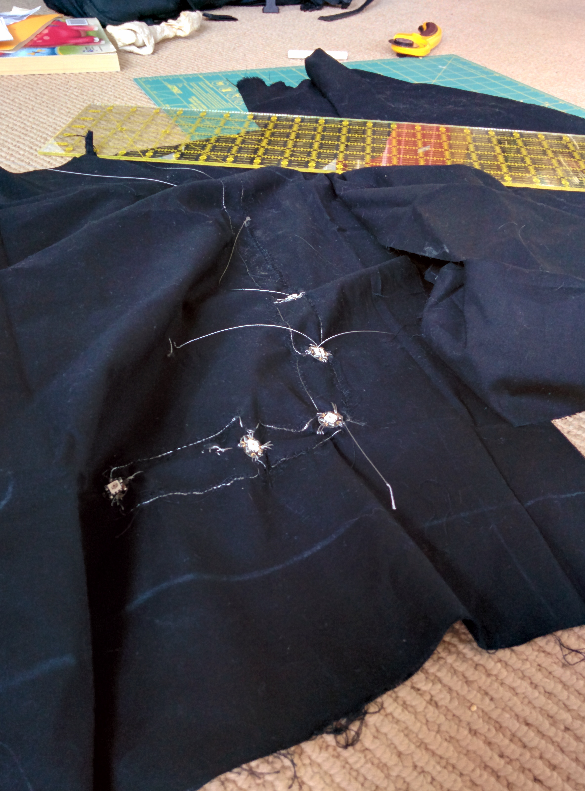

This weekend Danielle and I have been working on building a scarf with LEDs in it that will match whatever colour you place against it.
That's right, it's a CHAMELON SCARF.
Here are the steps

# Step 0: GET INSPIRED!

I was stumbling through the [Adafruit Learning Site](https://learn.adafruit.com/) and I found this:

ZOMG! It's so cool! BONUS: I had all the parts just lying around at home...

# Step 1: Gather materials

You will need the following:

 - Adafruit Flora
 - Sewable Neopixels
 - Steel thread
 - Conductive Fabric
 - Adafruit Color Sensor (TCS34725)
 - Clear nail polish
 - Fabric for a scarf

You can get most of this in a single pack from Adafruit here: https://www.adafruit.com/products/1458

# Step 2: Get Sewing

Here's the basic circuit diagram

We decided to go with more of a banada style scarf versus a proper loop.

The data lines for the neo pixels are actually strips of conductive fabric, rather than steel thread.

# Step 3: Solder!

I really liked the idea of using fabric snaps as shown here: https://learn.adafruit.com/flora-snaps/overview

It's actually pretty easy to solder, although the first few times I had too much solder on the snap and they didn't fit well
I even put some solder on the other half of the snaps to I could easily add and remove the colour sensor

# Step 4: Debug

Check ALL the wires.

Do it again.

# Step 5: Code



#include <Wire.h>
#include "Adafruit_TCS34725.h"
#include <Adafruit_NeoPixel.h>

// Parameter 1 = number of pixels in strip
// Parameter 2 = pin number (most are valid)
// Parameter 3 = pixel type flags, add together as needed:
//   NEO_RGB     Pixels are wired for RGB bitstream
//   NEO_GRB     Pixels are wired for GRB bitstream
//   NEO_KHZ400  400 KHz bitstream (e.g. FLORA pixels)
//   NEO_KHZ800  800 KHz bitstream (e.g. High Density LED strip)

Adafruit_NeoPixel strip = Adafruit_NeoPixel(5, 10, NEO_GRB + NEO_KHZ800);

Adafruit_NeoPixel onboard = Adafruit_NeoPixel(1, 8, NEO_RGB + NEO_KHZ400);

// our RGB -> eye-recognized gamma color
byte gammatable[256];

Adafruit_TCS34725 tcs = Adafruit_TCS34725(TCS34725_INTEGRATIONTIME_50MS, TCS34725_GAIN_4X);

void setup() {
  Serial.begin(9600);
  Serial.println("Color View Test!");

  strip.begin();
  strip.show(); // Initialize all pixels to 'off'
  onboard.begin();
  onboard.show();

  if (tcs.begin()) {
    Serial.println("Found sensor");
  } else {
    Serial.println("No TCS34725 found ... check your connections");
    while (1) {
      // halt!
      error();
    }
  }

  // thanks PhilB for this gamma table!
  // it helps convert RGB colors to what humans see
  for (int i = 0; i < 256; i++) {
    float x = i;
    x /= 255;
    x = pow(x, 2.5);
    x *= 255;

    gammatable[i] = x;
    //Serial.println(gammatable[i]);
  }

  for (int i = 0; i < 3; i++) { //this sequence flashes the first pixel three times as a countdown to the color reading.
    strip.setPixelColor (0, strip.Color(188, 188, 188)); //white, but dimmer-- 255 for all three values makes it blinding!
    strip.show();
    delay(1000);
    strip.setPixelColor (0, strip.Color(0, 0, 0));
    strip.show();
    delay(500);
  }

  uint16_t clear, red, green, blue;

  tcs.setInterrupt(false);      // turn on LED

  delay(60);  // takes 50ms to read

  tcs.getRawData(&red, &green, &blue, &clear);

  tcs.setInterrupt(true);  // turn off LED

  Serial.print("C:\t"); Serial.print(clear);
  Serial.print("\tR:\t"); Serial.print(red);
  Serial.print("\tG:\t"); Serial.print(green);
  Serial.print("\tB:\t"); Serial.print(blue);

  // Figure out some basic hex code for visualization
  uint32_t sum = red;
  sum += green;
  sum += blue;
  sum += clear;
  float r, g, b;
  r = red; r /= sum;
  g = green; g /= sum;
  b = blue; b /= sum;
  r *= 256; g *= 256; b *= 256;
  Serial.print("\t");
  Serial.print((int)r, HEX); Serial.print((int)g, HEX); Serial.print((int)b, HEX);
  Serial.println();

  Serial.print((int)r ); Serial.print(" "); Serial.print((int)g); Serial.print(" ");  Serial.println((int)b );
  colorWipe(strip.Color(gammatable[(int)r], gammatable[(int)g], gammatable[(int)b]), 0);
}

// Fill the dots one after the other with a color
void colorWipe(uint32_t c, uint8_t wait) {
  for (uint16_t i = 0; i < strip.numPixels(); i++) {
    strip.setPixelColor(i, c);
    strip.show();
    delay(wait);
  }
}

void loop() {

  //loop is empty because it only takes the color reading once on power up! Turn the scarf off and on again to change the color.

}

void error() {

  Serial.println(" :(");
  onboard.setPixelColor(0, strip.Color(80, 0, 0));
  onboard.show();
  delay(500);
  onboard.setPixelColor(0, 0);
  onboard.show();
  delay(500);
}


