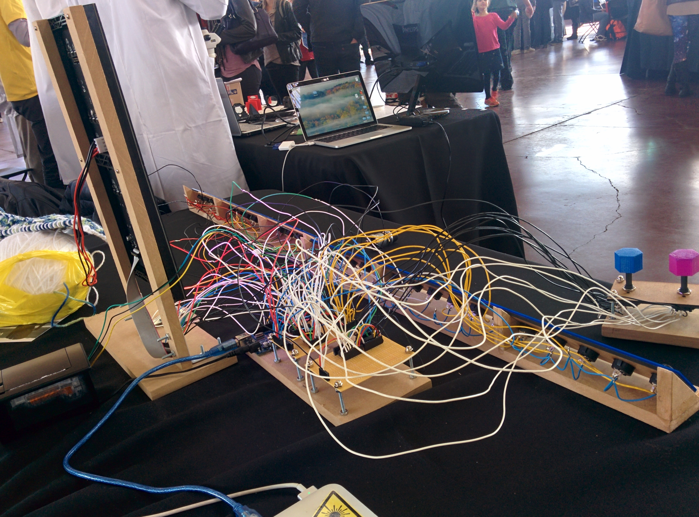
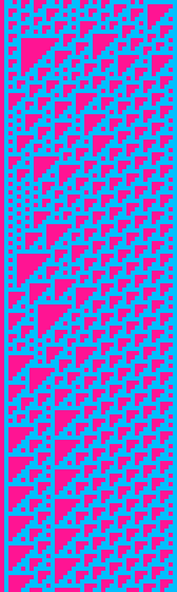
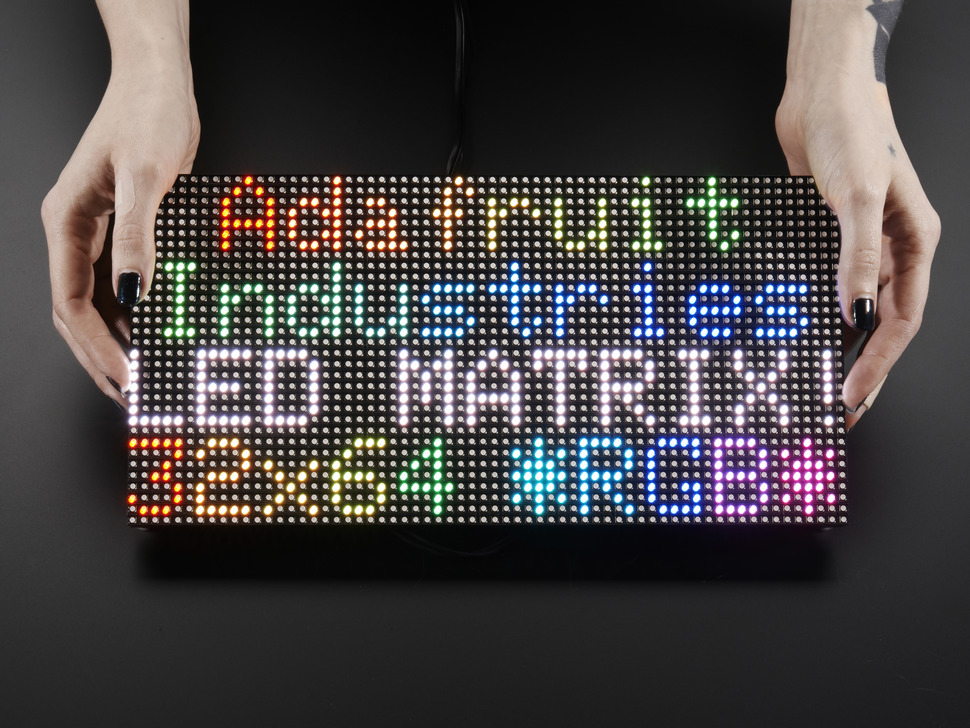
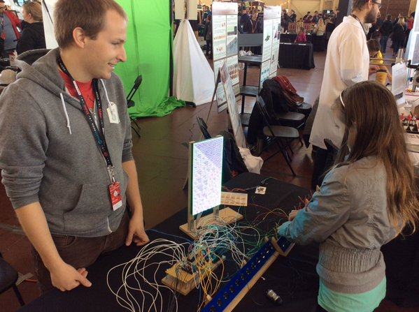
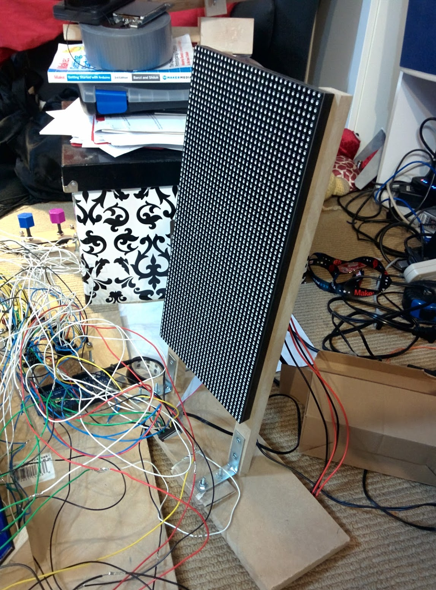
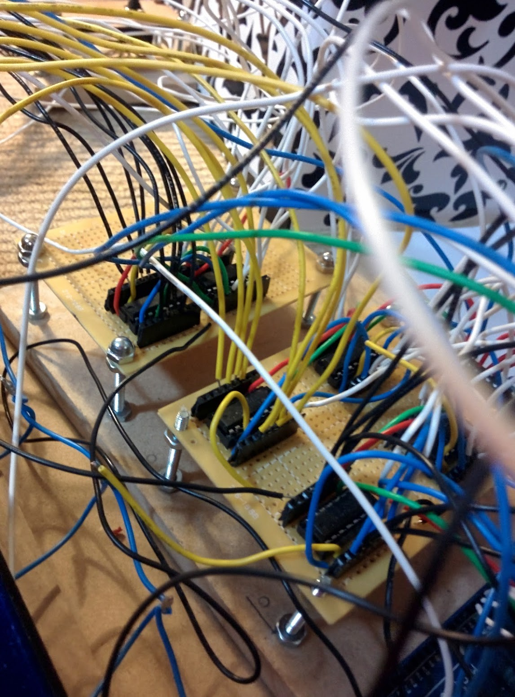

Wooohoo! I can now officially cross something off my bucket list:

 - run marathon
 - <strike>present project at Makerfaire</strike>
 - world domination?

So, what was my project? Here's a pic of it

What do you mean you don't know what is from that?

WELL.

What I built was basically part art, part math and part eletronics.
I hooked up an RGB LED Matrix (specifically [this one from adafruit](https://www.adafruit.com/products/2277)) to an Arduino Mega along with 32 switches.
(Note to future self: don't ever try and wire up 32 switches.)
These switches provided the starting row for generating a pattern on the led matrix based on [rule 110](https://en.wikipedia.org/wiki/Rule_110): a 1 dimensional cellular automaton that generates a pattern like this:

(from [@rule110_bot](https://twitter.com/rule110_bot))

but on an RGB LED Matrix, so it looks more like

## Why??

This all started out when I came across this fabulous kickstarter: [KnitYak: Custom mathematical knit scarves](https://www.kickstarter.com/projects/fbz/knityak-custom-mathematical-knit-scarves) by [fbz](https://twitter.com/fbz), which was for rule 110 scarfs.
I was immediatly struck by how beautiful the pattern was, and intriguied by the fact that it was being generated algorithmically.
After reading several wikipedia articles, my interest in the pattern had only grown further.
I ended up writing [a ruby implementation](https://github.com/tahnok/rule110) of rule 110 that could output patterns to your terminal, and then to pngs, and then finally to [twitter](https://twitter.com/rule110_bot).

But it was hard to mess around with the starting row and explore the patterns that got generated. I wanted something you could interact with, so when I saw that the Ottawa Makerfaire was looking for projects I figured it would be a perfect oppurtunity to force myself to build something and to have something interactive for attendees to play with.

## Hardware

Here's what inside:

 - Arduino Mega
 - 64x32 RGB LED matrix
 - Shift Registers (SN74HC165N) x 6
 - Rocker switches x 32
 - 8 position rotary switches x 2
 - 10K resistors x (lots)

The arduino mega is the brains of this particular operations.
I needed to use it over an uno because of the higher clock speed.
Turns out you need a fair bit of horse power to drive 2048 RGB LEDs.
Who would have thunk?

### RGB LED Matrix

How do you actually drive 2048 LEDs?

Basically, you can't have all those LEDs on at the same time (because power draw), so the LED matrix only turns 2 (out of 32) rows on at a time.
In order to select which row you want to light up, you use the 4 address select pins to select one of 16 pairs of rows.

Once you have a row selected, you need to fill it with colour.
You can set the colour of 2 pixels at a time using 2 sets of Red, Green and Blue pins.
When your desired colours are chosen you "shift" in the data, using the clock pin.
This way you can fill an entire row of pixels by setting the colour, then clocking in order to set the next pixel.
Finally, you toggle the latch pin, which shows the entire row of pixels.
If you do this FAST enough (like 200Hz aka 1 row every 5ms), the display looks to be continuously on to us puny humans.

I tried to write my own driver for the display in C for the Propeller, but I had some serious flickering issues that I wasn't able to fix...
Given that I didn't want to give everyone at makerfaire a headache / induce seizures I chose to use this library [from Adafruit](https://github.com/adafruit/RGB-matrix-Panel/).
It's a very interesting read because they do some neat things like [unrolling loops](https://github.com/adafruit/RGB-matrix-Panel/blob/master/RGBmatrixPanel.cpp#L541) and using Binary Coded Modulation (like PWM) in order to give a greater color depth than the 3 bit color you start with.

### Shift Registers

I ended up using 6 [shift register](https://en.wikipedia.org/wiki/Shift_register) for input in this project.
Why?
Well it means that I could use 4 pins to read 32 switches (aka 32 bits of data) all in one go.
That feat is accomplished with 4 shift register daisy chained together.
Each input pin on each of the shift registers has a pull down resistor in order to deal with electrical gremlins, and also to make my assembly time much much longer.

I also used 2 shift registers to read the state of the two knobs I have for selecting colours.
Those knobs have 8 pins to indicate which position the knob is in currently.

## Software

My code can be found below:





It's pretty bad because I wrote it the night before (as is my tradition for any large project)

Writing this was a fun excersise to see how well I understand arrays / pointers in C.
It turns out I still don't grok them, but with sufficient sacrifices to Malloc (all praise to It), I managed to get things working.

## Math

So, what the heck is the pattern I'm using anyway?

Basically, each pixel/cell (I'm going to call them cells from now on), except for the first row of dots, is set to one of two colors based on the 3 cells above it according to the following table:

|     |     |     |     |     |     |     | 
|:---:|:---:|:---:|:---:|:---:|:---:|:---:|:---:
| 111 | 110 | 101 | 100 | 011 | 010 | 001 | 000
|:---:|:---:|:---:|:---:|:---:|:---:|:---:|:---:
|  0  |  1  |  1  |  0  |  1  |  1  |  1  |  0

Where 1 is an "alive" cell and 0 is a "dead" cell.
The name comes from the fact that writing out 01101110 in decimal is 110, and there are other rules like [rule 30](https://en.wikipedia.org/wiki/Rule_30) and [rule 184](https://en.wikipedia.org/wiki/Rule_184).

If our alive colour was red, and our dead colour was blue, then a cell who had a red pixel up and to the left, another red pixel directly above, and a blue pixel above and to the right, then it would be alive and thus red.
In my project colours of the alive and dead cells are set using the 2 knobs.

Mind blowing fact: Rule 110 is *TURING COMPLETE*

(number 1 result on google image search for turing complete, filtered by gifs)

For those of you with minds still unblown, I am going to assume it's because you aren't familiar with turing completeness yet.
Basically, if a problem or program can be computed it can be run on a machine that is turing complete.
That means if I had enough time (and enough will) I would program a pattern into a rule 110 system that couple compute prime numbers, or play minecraft.

## Reactions

There were so many different reactions to my project.
Kids were immediately interested in playing with the buttons and the knobs.
Adults I had to cajole and encourage, which I think is a bit sad.
If this massive bank of switches wasn't supposed to be touched, don't you think I would have indicated that some way?

I could also tell immediately the people that wanted to figure out the pattern.
The first thing they would do after reseting the display for the first time, was to change a few switches and see what changed.
Then they would set all the switches to one position (up or down) and try that.
Then they would change just one switch.
The entire project was worth it for the looks on people's faces when they learned something new, either than confirmed some expectation, or suprised them

## Conclusions

All in all, it was totally a good idea for me to apply to makerfaire. This is one of the largest electronics projects I've yet completed, and I doubt I would have done it without the thought of an empty table. I guess I should start thinking about next year...
