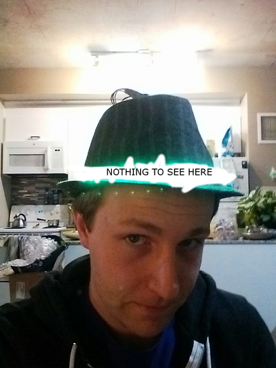
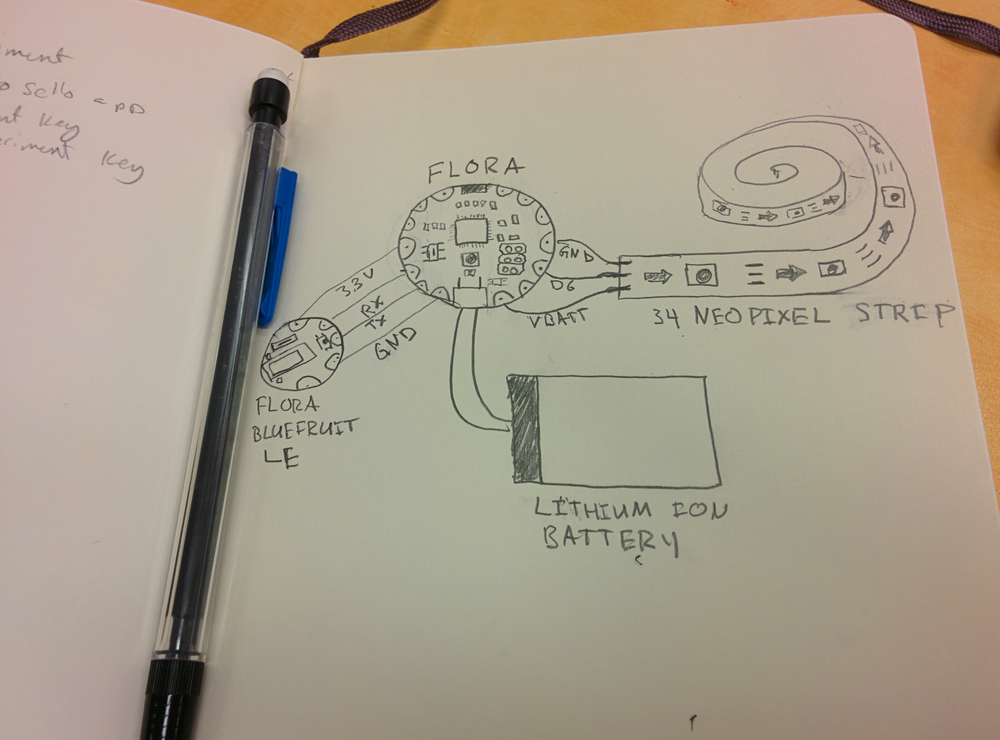
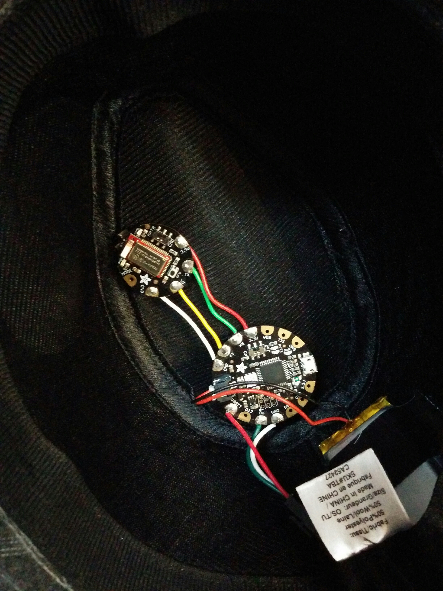
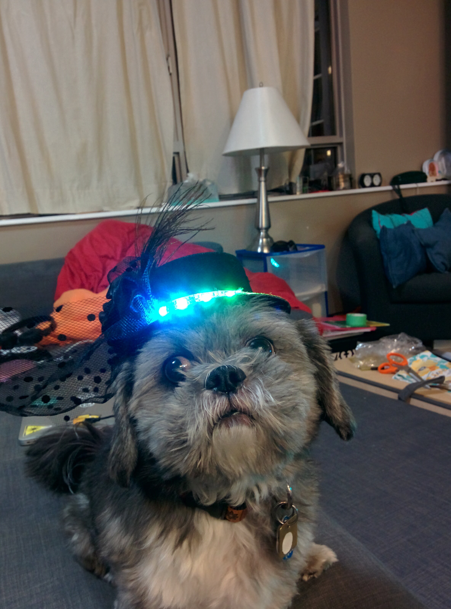

I recently needed to look swanky for a 1920s themed Holiday/Christmas party and I asked myself: What's the swankiest?

Of course! RGD LEDs on a hat! Controlled by Bluetooth! I shall call it... Project BLUE BRIM (because code names are awesome)

## Hardware

A trip to the second hand store and a pair of sciscorrs to remove an unwanted bow later, I had myself a pin stripe hat like this:

next I had to acquire the rest of my materials as follows:

 - 1 [Adafruit Flora](https://www.adafruit.com/products/659) at room temperature
 - 1 [Flora Bluefruit LE Module](https://www.adafruit.com/products/2487) sifted
 - a [34 Neopixel long strip](https://www.adafruit.com/products/1376) lightly buttered and cut down to size
 - 1 Lithium Ion Batter at 3.7v. I went with this [2500mAh model](https://www.adafruit.com/products/328), but it's a bit... overkill

Assembly is relatively straightforward. The circuit diagram looks like this:

Basically, the Bluetooth module is connected to the serial pins on the Flora.
Next, the Neopixel strip connected by attaching D6 to DIN, and VBATT to VIN (and GND to GND)

All soldered together it looks like this

I attached the LEDs to the hat by cutting a small whole with a sharp knife at the back of the hat large enough to fit the connectors.
I then used the adhesive backing on the strip to attach it to the hat, and it seems to be holding well.
On the top of the hat, I folded a few small strips of Gorilla tape in on itself and stuck those on the back of the flora and the ble module.
Finally, I slipped the battery into the small inner brim, and taped it to the back side of the hat.
When put together like this, it was actually really comfortable to wear.
It's a bit off balance, so I wouldn't recommend trying any hat tricks.

## Software

Writing the software for the hat was actually my favourite part.
Step 1 was getting the bluetooth stuff wired up.
Just like my [last project](http://blog.tahnok.me/post/makerfaire-ottawa-rule-110) I tried to write my own bluetooth socket reading [from scratch](https://github.com/tahnok/BlueBrim/commit/dd293916fff1c27bf15fd0662f389c0247ae8b09) but it was a bit too hacky for my liking.
Instead, I used the packet parser that [adafruit provides](https://github.com/adafruit/Adafruit_BluefruitLE_nRF51/blob/master/examples/neopixel_picker/packetParser.cpp), but I made sure to study the source closely to try and pick up some tricks for next time.
Basically, it looks like using a few nested loops and a timeout is the way to go.

The next bit was my favourite favourite part: MAKING PRETTY LIGHT PATTERNS!

Since I was going to use the [Adafruit Bluefruit LE Connect App](https://play.google.com/store/apps/details?id=com.adafruit.bluefruit.le.connect) and they have a neat control pad with 8 buttons, I figured I would need 8 patterns.
Because there were 2 sections, I decided that 4 patterns would be multi colour, and 4 patterns would use the current colour chosen with the colour picker part of the app.

The 4 multicolour patterns are:

[SPARKLE](https://github.com/tahnok/BlueBrim/blob/master/colors.cpp#L41) which has a single randomly coloured pixel.
It looks like this:

<video loop muted width="75%" controls src="../images/bluebrim_sparkle.mp4"></video>

[CYCLE](https://github.com/tahnok/BlueBrim/blob/master/colors.cpp#L47) which fades through 256 colours, with the whole strip lit with one colour at a time.

<video loop muted width="75%" controls src="../images/bluebrim_cycle.mp4"></video>

[RAINBOW](https://github.com/tahnok/BlueBrim/blob/master/colors.cpp#L55) which has a continuously changing section of rainbow, where each pixel is a different colour

<video loop muted width="75%" controls src="../images/bluebrim_rainbow.mp4"></video>

[PARTY](https://github.com/tahnok/BlueBrim/blob/master/colors.cpp#L62) where each pixel is a random colour

<video loop muted width="75%" controls src="../images/bluebrim_party.mp4"></video>

The 4 single colour patterns are:

[CYLON](https://github.com/tahnok/BlueBrim/blob/master/colors.cpp#L70) (or KITT depending on how old you are) has one pixel sliding back and forth across the front of the hat

<video loop muted width="75%" controls src="../images/bluebrim_cylon.mp4"></video>

[SOLID](https://github.com/tahnok/BlueBrim/blob/master/colors.cpp#L84) it's a solid colour. What more do you want?

<video loop muted width="75%" controls src="../images/bluebrim_solid.mp4"></video>

[PULSE](https://github.com/tahnok/BlueBrim/blob/master/colors.cpp#L91) slowly changes the brightness from nothing, to full brightness, back down to nothing again

<video loop muted width="75%" controls src="../images/bluebrim_pulse.mp4"></video>

[TWIST](https://github.com/tahnok/BlueBrim/blob/master/colors.cpp#L106) has a single pixel spinning around and around (and around (and around))

<video loop muted width="75%" controls src="../images/bluebrim_twist.mp4"></video>

You can see my source code in it's entireity on my [BlueBrim repo on Github](https://github.com/tahnok/BlueBrim), which uses some fancy multi file arduino to make it a bit easier to read.
I hope you learned something reading this, as a thank you here is a picture of my dog wearing the miniature version of this

