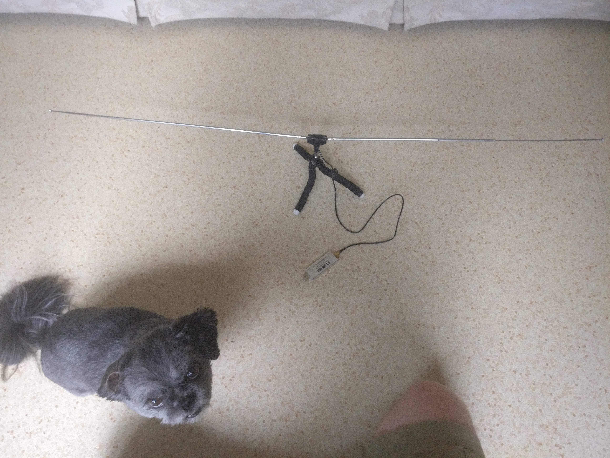
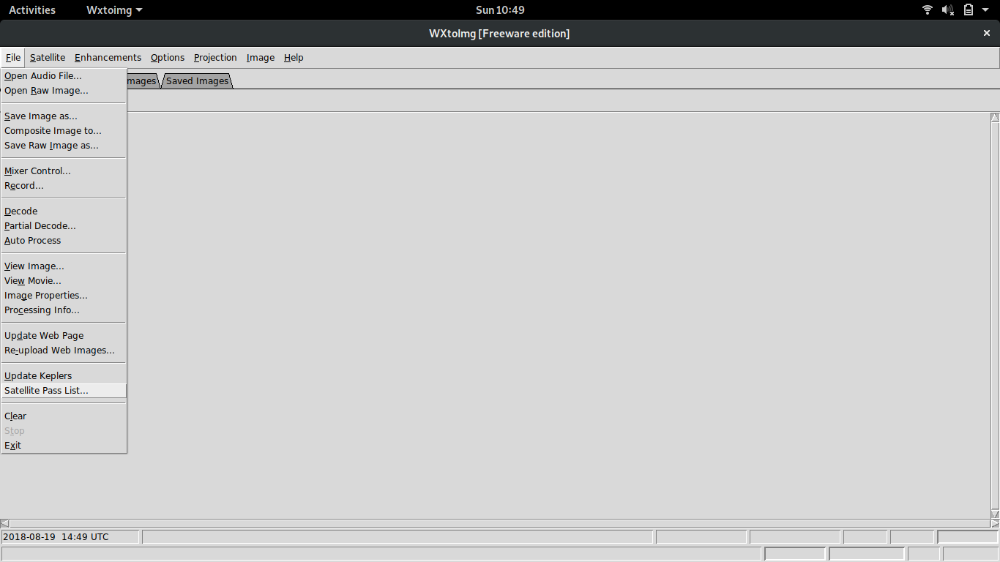
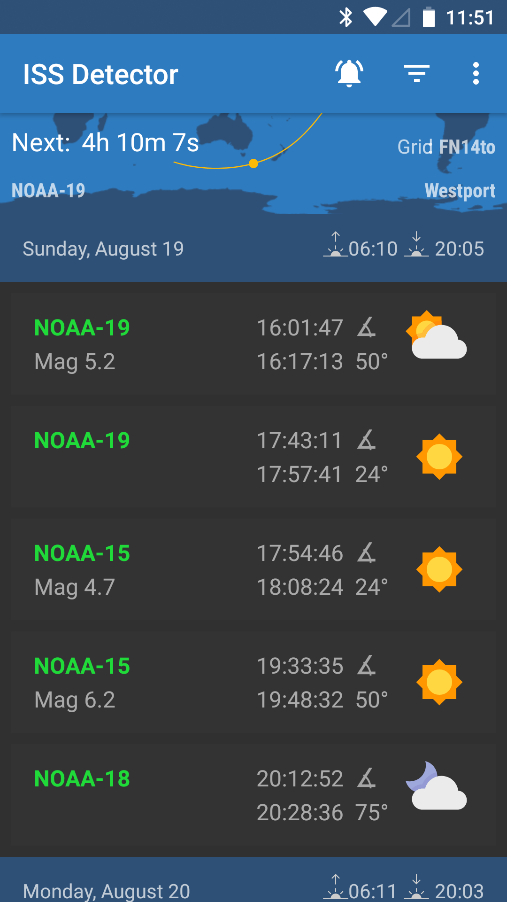

It had been a dream of mine for a while to receive images from space.
I forget where I learned that you could do that, but it sounded so cool I knew I wanted to try.
Around 2 years ago, I finally succeeded in getting images from the NOAA APT weather satellites, but I hadn't gotten around writing up how I did that until now.

My initial research led to lots of confusing information on many different topics.
What images were being broadcast and how?
What kind of antenna did I absolutely need?
How did I get the software and configure it?
Which were the satellites and how did I figure out when they were overhead?
Hopefully this post will explain what you need to know and what gear you will need.

There are 2 things you need to acquire:

 1. A receiver
 2. An antenna

And 3 things you need to know:

 3. How to figure out when you can receive an image from a satellite
 4. How to set up your receiver properly
 5. How to decode the image you receive

I'm gonna focus on the cheapest / easiest setup possible because that worked for me.

## Background: what is being transmitted and by whom?

Before we jump into the details of how to receive the images, we should first talk about who is broadcasting the images and how they are encoded.

The National Oceanic and Atmostpheric Association (NOAA) of the USA has several satellites in orbit to help them map weather.
Three of these satellites ([NOAA-15](https://en.wikipedia.org/wiki/NOAA-15), [NOAA-18](https://en.wikipedia.org/wiki/NOAA-18) and [NOAA-19](https://en.wikipedia.org/wiki/NOAA-18)) are of interest to us because they broadcast images using [Automatic Picture Transmission](https://en.wikipedia.org/wiki/Automatic_picture_transmission) at a frequency of 137 MHz.

Why are they of interest?

 1. 137 MHz antennas are pretty easy to build
 2. 137 MHz receivers are really cheap
 3. APT is an old protocol and there are lots of tools to decode it

These satellites are in a sun-synchronous orbit so they are always looking at the earth with the same amount of light.
They aren't geostationary (unlike satelitte TV satelittes) which means they aren't always overhead.
That just means that we need a tool to calculate when they will be overhead based on where you are.

## Setup

### Receiver: RTL-SDR

For the receiver I am using an RTL-SDR.
This is a device initially intended to receive European TV, but some clever hackers figured out how to turn it into a receiver across a huge range of frequencies.
Importantly for us it can receive ~137 MHz really well, and they are SUPER cheap.
You have a few choices for suppliers.

You can search ebay /
[amazon](https://www.amazon.com/NooElec-NESDR-Mini-RTL2832-Antenna/dp/B00P2UOU72/) /
[aliexpress](https://www.aliexpress.com/item/USB-2-0-Software-Radio-DVB-T-RTL2832U-R820T2-SDR-Digital-TV-Receiver-Stick/32506410349.html?spm=2114.search0104.3.1.4baa4658RQzNvA&ws_ab_test=searchweb0_0,searchweb201602_1_10152_10151_10065_10344_10130_10068_10547_10342_10343_10340_10548_10341_10696_10084_10083_10618_10139_10307_10059_100031_10103_10624_10623_10622_10621_10620,searchweb201603_55,ppcSwitch_5&algo_expid=34c8a973-1c12-475a-a4c5-51d2d38d9ac9-0&algo_pvid=34c8a973-1c12-475a-a4c5-51d2d38d9ac9&priceBeautifyAB=0) /
[adafruit](https://www.adafruit.com/product/1497) for either RTL-SDR or RTL2832U

This is your cheapest option, but the devices you will get here have 2 drawbacks.
First, they need to be frequency corrected.
This just means that if you tell the software to tune to 137 MHz, it will tune to a slightly different frequency (like 137.11MHz instead of 137.10 MHz)

Second, you need an adapter / pigtail to connect to an antenna.
These have a weird mini MCX connector that isn't standard for radio gear.
Most antennas for commercial / ham use have an SMA, BNC or UHF connector.
Thankfully, you can buy MCX to whatever connectors on ebay / amazon / aliexpress / adafruit as well.
Just search MCX to SMA or MCX to BNC.

Your other option is one of the redesigned / upgraded RTL-SDRs.
I bought one from rtl-sdr.com (a terrible name, but easy to remember the address) because it has an SMA connector and doesn't need to be calibrated.
Here's a link to the rtl-sdr.com store and choose the one with the dipole antenna kit: https://www.rtl-sdr.com/buy-rtl-sdr-dvb-t-dongles/

### Antenna: Dipole

There are plenty of better antennas for receiving satellites.
If you have looked into weather satellite antennas, you will hear mention of [the QFH or the double cross dipole](https://www.youtube.com/watch?v=cjClTnZ4Xh4).
These are better, but hard to make in terms of skill and in terms of gear required.

Instead, I have had great luck with the simplest antenna: the dipole.

Any dipole designed for 2m / 144 MHz should work, but if you are making your own you should tune it for 137MHz.

#### Bunny ears

One way to make a dipole is to acquire a pair of old TV bunny ears or a similar device.
That's what I have with the rtl-sdr.com package mentioned above.
If you can extend each side to be 52cm, you should be good to go.

#### Homemade dipole

For my first attempt, I built my own antenna.
I did this by buying a length of the thinnest brass rod I could find that would support it's own weight.
I cut 2 lengths to 52cm.
I calculated this number using this [online dipole calculator](http://www.kwarc.org/ant-calc.html)

Next, I soldered a bit of wire to both pieces.
Then I got a T-joint made of PVC and tapped these pieces so they were parallel to each other.

Finally, I connected the bits of wire to one of these [screw terminal BNC connectors](https://www.aliexpress.com/item/1-Set-CAT5-To-BNC-Video-And-Power-Balun-Transceiver-Connectors-Male-Female-BNC-Connector-Terminal/32813038993.html) that I got from Aliexpress.
This is probably the most weird / hard to find part of this build.
I've been thinking of other ways to do this, but so far ordering this and waiting the 35-50 days requried to get something from China is the easiest and the cheapest.

Feel free to use a different connector like SMA if that makes it easier to connect it to your RTL-SDR though.

### Finding passes: ISS Tracker

For my first attempts for figuring out when a satellite was overhead (a pass) and thus hearable, I used [wxtoimg](https://web.archive.org/web/20171226033343/http://www.wxtoimg.com:80/downloads/).
We will need this software later, but if you configure your ground station location (options -> ground station location), you can see a list of passes by going to file -> satellite pass list...

That worked OK, but I have found something better, if less free, the [ISS Detector Android app](https://play.google.com/store/apps/details?id=com.runar.issdetector)

It's poorly named, and a bit clunky to set up but it works really well.
It buzzes when a pass is about to happen.
It shows you the frequency of the satellite and it shows you were it will be coming from.

Once you have the app installed on your phone, go to the overflow menu (the vertical ...) and hit extensions and buy the Amateur Radio Satellites package.
Next, go to filters and turn on amateur radio satellites and select the following 3 satellites:

 - NOAA-15
 - NOAA-18
 - NOAA-19

When you see a good pass (that is something with an elevation over 30 degress, but higher is better) it's time to find a good spot.

I've found parks or open are really good, but any spot with a clear view of the sky that's well away from any buildings will work.

### Receiving software: SDRSharp

Now that you have an antenna and a receiver, it's time to you know... receive.

I'm using windows, so I am using [SDRSharp](https://airspy.com/download/) (or SDR#).

Once you have that installed, it's time to set it up.
I recommend following this [guide from rtl-sdr.com](https://web.archive.org/web/20181114212055/https://www.rtl-sdr.com/rtl-sdr-quick-start-guide/) as there are is an extra file to download and a specific way to set up the drivers on windows.

Each satellite has a different frequency

 - NOAA-15: 137.620 MHz
 - NOAA-18: 137.913 MHz
 - NOAA-19: 137.100 MHz

You can tune to that frequency at the top of SDRsharp

Once you have the frequency selected, it's time to choose the receiving mode.
You want to use the WFM (wide FM) mode and you want to have a have a bandwidth of 55,000 Hz (55 KHz)

### Decoding: WXtoImg

The satellites transmit images using an encoding called APT (Automatic Picture Transmission).
If you listen to it, it sounds like repeating deet-deet deet-deet.
You can hear a sample on the [Signal Identification Wiki APT page](https://www.sigidwiki.com/wiki/Automatic_Picture_Transmission_(APT))

In order to decode it, I used a program called [WXtoImg](https://web.archive.org/web/20171226033343/http://www.wxtoimg.com:80/downloads/).
The original site that hosted the program is offline at the time of me writing this (August 2018), but it's still available from archive.org

Once you have it installed, set your ground station location (under options)

You need a way to connect the audio output of SDRSharp to WXtoImg.
If you are lucky, your sound card has some kind of monitor or loopback interface.
I was not lucky, so instead I used [VB-Cable Virtual Audio Device](https://www.vb-audio.com/Cable/).
Once installed, this virtual cable gives you a fake output device and a fake input device that are connected.

I changed SDRSharp to output to "[Windows Direct Sound] CABLE Input" but "[MME] Cable Input" also worked.
(I have no idea what the difference is)

In WXtoImg, I changed the soundcard to use "CABLE Output" by going to options -> recording options -> Common Recording Options

## Putting it together: receive PICTURES FROM SPACE

 1. Use ISS tracker or WXtoImg to find a good pass at a time that works for you
 2. Get your antenna out and connected to the RTL-SDR
 3. Launch SDRSharp and tune it to the right frequency for the satellite that will be overhead. Make sure the mode is set right (WFM with 50KHz bandwidth) and the output is set to the CABLE Input
 4. Launch WXtoImg and make sure the soundcard is set to CABLE Output
 5. Get WXtoImg to record by going to File -> Record ... -> Auto Record
 6. Watch for the APT signal in SDRSharp. You will have to zoom in a bit, but you should see a series of several spikes
 7. Point your antenna! Try turning, tilting, or pointing the antenna so that the signal appears stronger. If you hover over the signal in SDR# it will tell you what the SNR is. I have found you need at least -25db
 8. wait... wxtoimg has a progress bar in the bottom corner. Aim for 100%, but a partial pass still works
 9. Stop WXtoImg (File -> Stop) and check out your space picture!

## Results

NOAA 15

NOAA 18

NOAA 19
