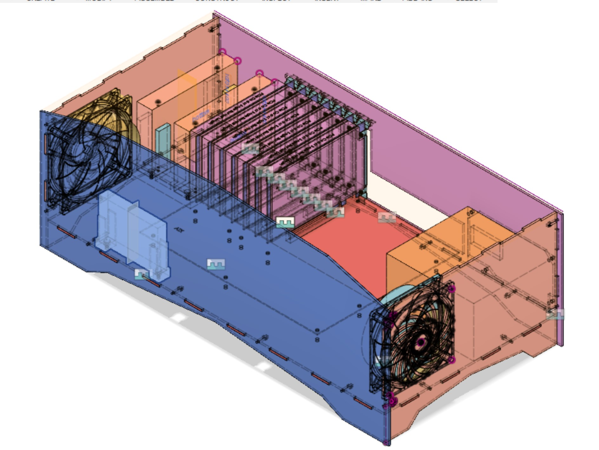

I've been working on this project for over a year now, but I can finally share it comfortably. Presenting: **LACC** Lasercut ATX Computer case

This all came about because I needed a computer case (for a computer) and I went looking online to see if anyone had made one that could be cut on a laser cutter.
Much to my dissapointment, I couldn't find any!
So I said fine, I'll freaking build one.

You can download all the files [here](../images/LACC-20190310.zip) from this blog, but I've also uploaded the design to [github](http://github.com/tahnok/LACC) and [thingiverse](https://www.thingiverse.com/thing:3483130) for... marketing/posterity.

I hope it proves useful as a template for further customization.
Adding extra art work to be etched into the front/side/top with a laser should be _really_ easy to do.

This is a full sized ATX computer case you can laser cut (and probably cut using a CNC but I don't have one of those)

It should fit any ATX compliant motherboard, but I've only tried the one motherboard I have.

It has space for 3x 3.5" hard drives and a 2.5" hard drive, which are held by seperate 3d printed modules.

The entire design was done in Fusion 360. You can view it / download it [here](https://a360.co/2EToDJn)

[more photos](https://photos.app.goo.gl/nMJByEWeSShFq6Pd6)

## Materials

### Case
 - 5x sheets of 24" x 12" sheet of 1/8" or 3mm acrylic or MDF*
 - 26x M3 nuts
 - 20x M3x16 screws (for holding case together)
 - 6x M3x12 standoffs (for motherboard)
 - 6x M3x4 screws (for standoffs)
 - 2x 120mm Computer Fan
 - 4x 6-32 screws for ATX power supply

*You might worry about MDF catching fire, but it [catches fire at 200C](https://www.westfraser.com/sites/default/files/products/MDF/WP-GoldPlus%202013.pdf)

### Hard Drive Bays
 - 2x of the 3.5" drive holder parts
 - 2x of the 2.5" drive holder parts
 - 6x M3x10 screws
 - 6x M3 nuts

## Models Used

 - [Accurate Blank Motherboard & PCIe Card Models](https://smallformfactor.net/forum/resources/accurate-blank-motherboard-pcie-card-models.25/) by subtec
 - [120mm PC Case Fan](https://grabcad.com/library/120mm-pc-case-fan-1) by
Ollie Keattch
 - Power supply (mine)
 - Hard Drive 2.5" and 3.5" (mine)

## License

[Creative Commons Attribution-ShareAlike 4.0 International](https://creativecommons.org/licenses/by-sa/4.0/)

You are free to use, sell and remix freely as long as any modifications you make are also shared under this same license

## Next revision

So far it's working pretty well, but I have a few extra things that I need to change

 1. The tabs between the PCI-E cards are wayyyy to tiny. I need to make them bigger
 1. There is no power button... My mobo has one built in, but yours may not.
